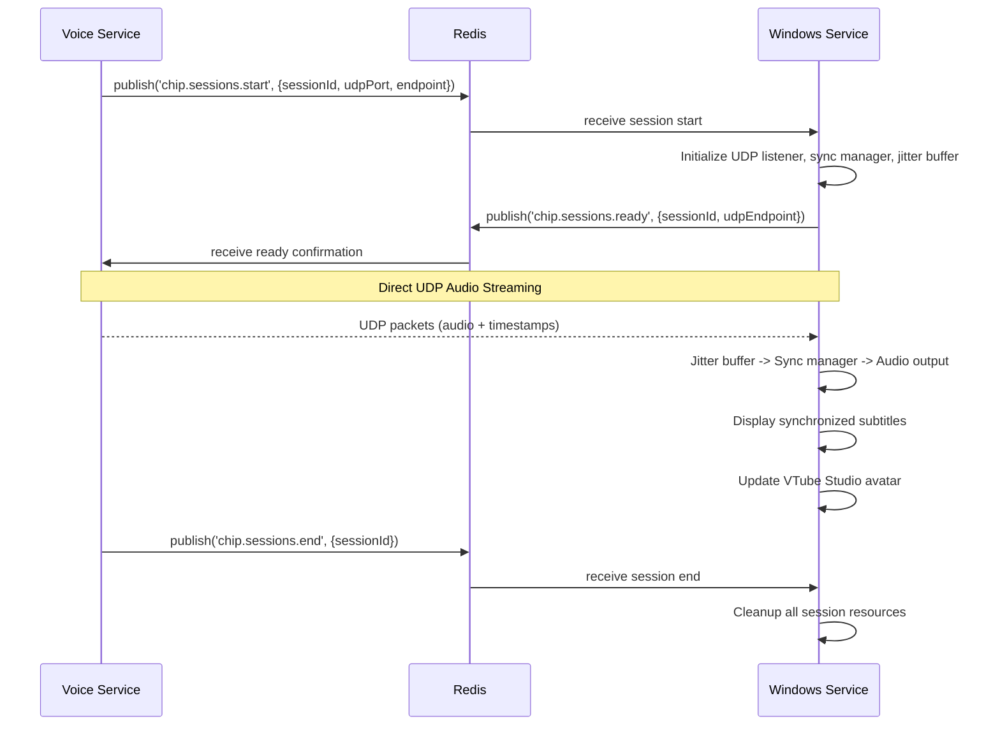

# CHIP Windows Output Service - Implementation Guide

## Overview

This guide documents the implementation of a hybrid Redis/UDP audio streaming architecture for the CHIP Windows Output Service, providing low-latency audio playback with synchronized subtitles and VTube Studio integration.

## Architecture

### Hybrid Design Philosophy

**Problem:** Redis pub/sub introduces 50-200ms+ latency, unacceptable for real-time audio.

**Solution:** Hybrid architecture that separates control plane from data plane:
- **Redis:** Control messages (session management, health monitoring, configuration)
- **UDP:** Direct audio streaming with <20ms latency
- **Windows Integration:** System tray, subtitle overlay, VTube Studio connection

```
┌─────────────────┐    Redis Pub/Sub     ┌──────────────────┐
│   Voice Service │◄────(control)────────┤  Windows Service │
│                 │                      │                  │
│                 │    Direct UDP/TCP    │                  │
│                 │◄────(audio)──────────┤                  │
└─────────────────┘                      └──────────────────┘
```

## Core Components

### 1. Type Definitions (`src/types.ts`)

Enhanced type system supporting:
- UDP audio packets with sequencing and timestamps
- TTS synchronization data
- Network condition monitoring
- VTube Studio integration types
- Subtitle synchronization structures

Key interfaces:
```typescript
interface AudioPacket {
  sessionId: string;
  sequenceNumber: number;
  timestamp: number;          // TTS generation timestamp
  playbackTime: number;       // When this should be played
  audioData: Buffer;
  format: AudioFormat;
  sampleRate: number;
  isLast: boolean;
}

interface SubtitleData {
  text: string;
  startTime: number;          // Relative to audio start (ms)
  endTime: number;            // Relative to audio start (ms)
  ttsOffset: number;          // TTS processing delay
  confidence?: number;
}
```

### 2. UDP Audio Server (`src/udp-audio-server.ts`)

**Purpose:** Receives audio packets directly from voice service with minimal latency.

**Features:**
- Binary packet deserialization
- Session management and statistics
- Network condition monitoring (latency, jitter, packet loss)
- Packet loss detection and reporting

**Protocol:**
```
[sessionId length:1][sessionId:variable][sequenceNumber:4][timestamp:8]
[playbackTime:8][format:1][sampleRate:4][isLast:1][audioData length:4][audioData:variable]
```

### 3. Audio Synchronization Manager (`src/audio-sync-manager.ts`)

**Purpose:** Coordinates precise timing between TTS timestamps and audio playback.

**Key Functions:**
- Calculate playback timing based on TTS timestamps
- Compensate for network latency and processing delays
- Schedule synchronized subtitle display
- Maintain session timing baselines

**Timing Strategy:**
1. First packet establishes baseline timing
2. Calculate clock offset between TTS and local time
3. Schedule subsequent packets relative to baseline
4. Apply network condition adjustments

### 4. Jitter Buffer (`src/jitter-buffer.ts`)

**Purpose:** Smooth out network timing variations for consistent playback.

**Features:**
- Adaptive buffer sizing based on network conditions
- Packet reordering and duplicate detection
- Underrun/overrun protection
- Performance statistics and monitoring

**Configuration:**
```typescript
interface JitterBufferConfig {
  targetBufferMs: number;     // Target buffer size (100ms default)
  minBufferMs: number;        // Minimum buffer (50ms default)
  maxBufferMs: number;        // Maximum buffer (300ms default)
  adaptiveMode: boolean;      // Adjust based on network conditions
}
```

## Connection Flow

### Session Negotiation Sequence



### Redis Control Messages

**Session Start:**
```json
{
  "type": "SESSION_START",
  "sessionId": "uuid-12345",
  "audioStreamPort": 8001,
  "clientEndpoint": "10.0.1.100:8001",
  "expectedFormat": "pcm",
  "sampleRate": 44100,
  "estimatedDuration": 30000
}
```

**Session Ready Confirmation:**
```json
{
  "type": "SESSION_READY", 
  "sessionId": "uuid-12345",
  "receiverReady": true,
  "udpEndpoint": "localhost:8001",
  "bufferSize": 100
}
```

**Session End:**
```json
{
  "type": "SESSION_END",
  "sessionId": "uuid-12345", 
  "reason": "COMPLETED",
  "statistics": {
    "totalPackets": 1500,
    "lostPackets": 2,
    "avgLatency": 15,
    "jitterMs": 3
  }
}
```

## Windows Integration Features

### VTube Studio Integration

**WebSocket Connection:**
- Connect to VTube Studio API (default port 8001)
- Real-time lip sync based on audio amplitude analysis
- Expression triggers from TTS emotion data
- Avatar parameter control (mouth movement, eye tracking)

**Lip Sync Algorithm:**
1. Analyze audio buffer for amplitude peaks
2. Map amplitude to mouth opening parameters
3. Apply smoothing to prevent jitter
4. Send parameter updates via WebSocket

### Subtitle Display Options

**1. OBS WebSocket Integration:**
- Send subtitles to OBS as text source updates
- Supports styling and positioning
- Zero latency overlay on stream

**2. System Overlay Window:**
- Transparent window overlay on screen
- Always-on-top subtitle display
- Customizable positioning and styling

**3. Windows Toast Notifications:**
- System notification for subtitle text
- Good for accessibility
- Minimal visual impact

### System Tray Service

**Features:**
- Status indicator (connected/disconnected/error)
- Active session counter
- Quick access to configuration
- Graceful shutdown control

**Menu Options:**
- Show/Hide Configuration Window
- View Active Sessions
- Open Logs
- Exit Service

## Configuration

### Environment Variables

```env
# Redis Control Plane
REDIS_HOST=localhost
REDIS_PORT=6379
REDIS_PASSWORD=optional

# UDP Audio Streaming  
UDP_AUDIO_PORT=8001
JITTER_BUFFER_TARGET_MS=100
JITTER_BUFFER_MIN_MS=50
JITTER_BUFFER_MAX_MS=300
JITTER_BUFFER_ADAPTIVE=true

# VTube Studio Integration
VTUBE_STUDIO_ENABLED=true
VTUBE_STUDIO_HOST=localhost
VTUBE_STUDIO_PORT=8001
VTUBE_STUDIO_API_KEY=your_api_key
VTUBE_STUDIO_LIP_SYNC_SENSITIVITY=0.8

# Subtitle Display
SUBTITLES_ENABLED=true
SUBTITLES_METHOD=obs-websocket  # obs-websocket | overlay | toast
SUBTITLES_DISPLAY_DURATION=5000
OBS_WEBSOCKET_HOST=localhost
OBS_WEBSOCKET_PORT=4455
OBS_WEBSOCKET_PASSWORD=optional

# Audio Output
AUDIO_OUTPUT_TYPE=speaker  # speaker | ffplay | vlc | file
AUDIO_DEVICE=optional_device_name
AUDIO_BUFFER_SIZE=4096
SAVE_TO_FILE=false
AUDIO_OUTPUT_DIR=./audio-output

# System Integration
SYSTEM_TRAY_ENABLED=true
AUTO_START_WITH_WINDOWS=true
CONFIG_GUI_ENABLED=true

# Monitoring and Metrics
METRICS_ENABLED=true
METRICS_PORT=9090
LOG_LEVEL=info
LOG_FORMAT=json

# Performance Tuning
MEMORY_LIMIT_MB=200
SESSION_TIMEOUT_MS=300000
CLEANUP_INTERVAL_MS=30000
```

## Performance Targets

### Latency Benchmarks
- **End-to-end Audio Latency:** <20ms (vs 200ms+ with Redis pub/sub)
- **Subtitle Synchronization:** <5ms drift from audio
- **VTube Studio Response:** <10ms for lip sync updates
- **Session Startup Time:** <500ms for full initialization

### Resource Usage
- **Memory Usage:** <100MB steady state, <200MB peak
- **CPU Usage:** <5% during active streaming
- **Network Bandwidth:** Efficient UDP protocol, ~1Mbps for high-quality audio
- **Disk I/O:** Minimal, only for logging and optional audio saving

## Implementation Steps

### Phase 1: Core Infrastructure
1. ✅ Update type definitions for hybrid architecture
2. ✅ Implement UDP audio streaming server
3. ✅ Create audio synchronization manager
4. ✅ Implement jitter buffer for network compensation

### Phase 2: Integration Components
5. 🔄 Add subtitle synchronization system
6. 🔄 Update Redis message handlers for control plane
7. 🔄 Create connection negotiation system
8. 🔄 Add monitoring and metrics for hybrid system

### Phase 3: Windows Features
9. ⏳ Implement VTube Studio WebSocket connector
10. ⏳ Create subtitle overlay system (OBS/direct)
11. ⏳ Add Windows system integration (tray, auto-start)
12. ⏳ Build configuration GUI with Electron

### Phase 4: Production Ready
13. ⏳ Comprehensive error handling and recovery
14. ⏳ Performance optimization and tuning
15. ⏳ Security hardening and validation
16. ⏳ Automated testing suite
17. ⏳ MSI installer and deployment package

## Deployment Strategy

### Development Environment
```bash
# Install dependencies
npm install

# Development with hot reload
npm run dev

# Build production version
npm run build

# Start production service
npm start
```

### Production Deployment

**Option 1: Node.js Service**
```bash
# Install as Windows service using node-windows
npm install -g node-windows
npm run install-service
```

**Option 2: Standalone Executable**
```bash
# Build standalone executable with pkg
npm run build:exe
```

**Option 3: MSI Installer**
```bash
# Create MSI installer package
npm run build:msi
```

## Monitoring and Observability

### Health Check Endpoint
```
GET /health
{
  "status": "healthy",
  "uptime": 360000,
  "activeSessions": 2,
  "components": {
    "redis": "healthy",
    "udpServer": "healthy", 
    "vtubeStudio": "connected",
    "subtitleOverlay": "ready"
  },
  "memory": {
    "used": 45000000,
    "limit": 209715200,
    "percentage": 21.5
  }
}
```

### Prometheus Metrics
- `audio_packets_received_total`: Total UDP packets received
- `audio_latency_histogram`: End-to-end audio latency distribution
- `jitter_buffer_size`: Current jitter buffer size per session
- `subtitle_sync_error_ms`: Subtitle synchronization accuracy
- `vtube_studio_commands_sent`: VTube Studio API calls made
- `active_sessions_total`: Currently active audio sessions
- `network_conditions`: Latency, jitter, and packet loss metrics

### Logging Strategy
- **Structured JSON logging** with correlation IDs
- **Log levels:** ERROR, WARN, INFO, DEBUG
- **Log rotation** to prevent disk space issues
- **Performance logging** for latency analysis
- **Session tracing** for debugging synchronization issues

## Troubleshooting Guide

### Common Issues

**High Audio Latency:**
1. Check network conditions between voice service and Windows service
2. Verify jitter buffer configuration (reduce target buffer size)
3. Monitor CPU usage during playback
4. Check Windows audio device latency settings

**Subtitle Desync:**
1. Verify TTS timestamps are accurate in source data
2. Check system clock synchronization
3. Monitor subtitle display method latency (OBS vs overlay)
4. Adjust subtitle timing compensation settings

**VTube Studio Connection Issues:**
1. Verify VTube Studio API is enabled
2. Check WebSocket connection parameters
3. Confirm API key authentication
4. Monitor VTube Studio plugin status

**Session Management Problems:**
1. Check Redis connectivity and pub/sub subscriptions
2. Verify UDP port availability and firewall rules
3. Monitor session cleanup and resource deallocation
4. Check memory usage for potential leaks

### Performance Optimization

**Network Optimization:**
- Use dedicated network interfaces for audio if possible
- Configure QoS rules for UDP audio packets
- Monitor and adjust jitter buffer parameters
- Consider packet prioritization

**Audio Optimization:**
- Choose optimal audio buffer sizes for your hardware
- Use dedicated audio devices for output
- Configure Windows audio exclusively mode if needed
- Monitor audio dropouts and adjust accordingly

**System Optimization:**
- Run service with elevated priority
- Disable Windows power management for audio devices
- Configure Windows for low-latency audio processing
- Monitor system resource usage and optimize

## Security Considerations

### Network Security
- UDP packets should include checksums for integrity
- Consider encryption for sensitive audio content
- Implement rate limiting for UDP packet processing
- Monitor for potential DDoS attacks on UDP port

### System Security
- Run service with minimal required privileges
- Validate all input data from Redis and UDP sources
- Implement session authentication and authorization
- Regular security updates for all dependencies

### Data Privacy
- Audio data is processed in memory only (unless saving enabled)
- Implement secure cleanup of audio buffers
- Consider data retention policies for logs and metrics
- Comply with applicable privacy regulations

## Future Enhancements

### Advanced Features
- **Multi-channel audio support** for surround sound
- **Audio effects processing** (reverb, echo, filters)
- **Dynamic quality adjustment** based on network conditions
- **Load balancing** across multiple Windows services

### Integration Expansions
- **OBS Studio plugin** for deeper integration
- **Discord bot integration** for voice channel output
- **Streaming platform APIs** (Twitch, YouTube)
- **Hardware controller support** (Stream Deck, etc.)

### Performance Improvements
- **GPU-accelerated audio processing** for effects
- **Multi-threaded packet processing** for higher throughput
- **Memory pool optimization** for reduced garbage collection
- **Custom audio drivers** for ultra-low latency

---

## Summary

This implementation guide provides a complete roadmap for building a production-ready Windows Output Service that achieves:

- **Sub-20ms audio latency** through direct UDP streaming
- **Perfect subtitle synchronization** using TTS timestamps
- **Seamless VTube Studio integration** for avatar control
- **Professional Windows service** with system tray and auto-start
- **Comprehensive monitoring** and error handling
- **Scalable architecture** supporting multiple concurrent sessions

The hybrid Redis/UDP approach gives you the reliability of Redis for control messages while achieving the performance of direct streaming for audio data - the best of both worlds for real-time voice assistant applications.